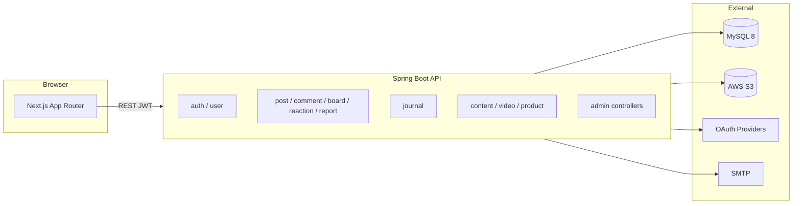

# Herfree 아키텍처 개요

코드를 처음 보는 사람(리뷰어·면접관·협업자)이 **어디에 무엇이 있는지** 빠르게 파악하기 위한 문서다.  
상세 API·테이블·배포 절차는 각각 [`api-spec.md`](./api-spec.md), [`erd.md`](./erd.md), [`deployment-aws.md`](./deployment-aws.md)를 본다.

## 1. 시스템 한눈에



| 영역 | 역할 |
| --- | --- |
| **커뮤니티** | 익명 게시판·댓글·공감·신고. 비밀사연·문의 등은 마스킹 정책 적용 |
| **일지** | 회원 본인만 조회·수정. 공개 통계는 동의·최소 표본 조건 후 집계 |
| **CMS** | 운영자가 정보글·YouTube 영상·(향후) 제품 큐레이션 등록 |
| **인증·회원** | 이메일·OAuth 가입, JWT, 약관·건강통계 동의, 탈퇴 시 원문 파기 |

**환경(local / staging / production)은 코드 브랜치가 아니라 Spring profile과 `.env`로만 구분한다.**  
코드에 `// staging용` 주석을 두거나 기능을 주석 처리해 환경을 바꾸지 않는다. → [`go-live-checklist.md` §1](./go-live-checklist.md)

---

## 2. Git·배포와 코드의 관계

```text
feature/*  ──PR──►  develop  ──PR──►  main  ──Actions──►  staging ──►  production
fix/*              (통합)           (배포 기준)         (같은 커밋 SHA 이미지)
```

| 개념 | 설명 |
| --- | --- |
| **커밋 메시지** | `feat` / `fix` / `test` / `ci` 등 **변경 종류**. “테스트용 커밋”“배포용 커밋”으로 나누지 않음 |
| **`develop`** | 여러 기능을 모아 CI 통과를 확인하는 **통합 브랜치** |
| **`main`** | 항상 배포 가능. GitHub Actions `Release backend`의 소스 |
| **staging / prod** | GitHub Environment + `/opt/herfree/config/.env.*`. **코드 브랜치 아님** |

자세한 브랜치·보호 규칙: [`git-workflow.md`](./git-workflow.md)

---

## 3. 백엔드 (`backend/src/main/java/com/herfree`)

### 3.1 패키지 구조

```text
com.herfree
├── domain/          # 도메인별 controller · service · repository · entity · dto
│   ├── auth         # 로그인·회원가입·OAuth·비밀번호 재설정
│   ├── user         # 프로필·약관·건강통계 동의·관리자 회원 관리
│   ├── board        # 게시판 메타
│   ├── post         # 게시글·이미지·공지·스크랩
│   ├── comment      # 댓글
│   ├── reaction     # 공감
│   ├── report       # 신고·처리
│   ├── journal      # 비공개 증상 일지·집계 API
│   ├── content      # 정보글 CMS
│   ├── video        # YouTube 큐레이션
│   ├── product      # 제품 CMS (런칭 시 UI 비노출 가능)
│   ├── analytics    # 이벤트·관리자 통계
│   └── audit        # 관리자 감사 로그
└── global/          # security · exception · storage · config (횡단 관심사)
```

계층 규칙: **Controller → Service → Repository**. Entity는 API에 직접 노출하지 않고 Request/Response DTO를 쓴다.

### 3.2 Service 전체 (읽기 시작점)

각 `domain/*/package-info.java`와 Service 클래스 JavaDoc에 **역할·API prefix·보안 근거**를 적어 두었다.

| Service | 패키지 | 하는 일 |
| --- | --- | --- |
| `AuthService` | auth | 이메일 가입·로그인, JWT, 계정 열거 완화 |
| `OAuthAuthService` | auth | OAuth, 프로필 미완성 중간 토큰 |
| `LoginLockoutService` | auth | 로그인 10회 실패 시 30분 잠금 (인메모리) |
| `PasswordResetService` | auth | 재설정 토큰·동일 성공 메시지 |
| `PasswordResetMailService` | auth | SMTP 발송, 운영 fallback 없음 |
| `UserService` | user | 프로필·마이페이지·탈퇴·닉네임 쿨다운 |
| `AdminUserService` | user | 관리자 회원 검색·역할·상태 |
| `UserConsentAgreementService` | user | 약관·민감정보 동의 이력 |
| `HealthStatisticsConsentService` | user | 건강통계 활용 선택 동의 |
| `RoleAuditService` | user | 역할 변경 감사 |
| `BoardService` | board | 활성 게시판 메타 |
| `PostService` | post | 게시글 CRUD·마스킹·검색 |
| `PostImageAccessService` | post | 이미지 서빙 시점 권한 |
| `PostImageCleanupService` | post | S3·DB 이미지 정리 |
| `PostBookmarkService` | post | 스크랩 |
| `AdminNoticeService` | post | 공지 CMS |
| `CommentService` | comment | 댓글 CRUD |
| `ReactionService` | reaction | 공감 toggle |
| `ReportService` | report | 신고·처리 근거 |
| `JournalService` | journal | 비공개 일지·공개 insight |
| `ContentService` | content | 정보글 CMS |
| `VideoService` | video | YouTube CMS |
| `ProductService` | product | 제품 큐레이션 CMS |
| `AnalyticsService` | analytics | 이벤트·관리자 통계 |
| `AdminAuditService` | audit | 관리자 API 감사 |

프론트 정책: `frontend/src/domain/` — [`domain/README.md`](../frontend/src/domain/README.md)

### 3.3 대표 흐름

#### A. 회원가입 → 일지 기록

```text
POST /api/auth/signup
  → AuthService (User + UserProfile + 약관·건강통계 동의)
  → JWT access token

PUT /api/journal/records/{date}
  → JournalService.upsert (본인 userId만)
  → journal_records 테이블
```

#### B. 게시글 이미지 (S3 프록시)

```text
클라이언트 → API presign/업로드 → S3 posts/{userId}/...
표시 URL   → /api/posts/images/object/** 프록시
           → PostImageAccessService.check (게시글 공개범위·비밀사연 재확인)
```

#### C. 공개 건강 통계

```text
GET /api/journal/insights (비로그인 가능)
  → JournalService: 동의 유효 회원만 집계
  → 전체 20명 미만 또는 셀 5명 미만이면 해당 항목 미공개
```

---

## 4. 프론트엔드 (`frontend/src`)

### 4.1 디렉터리

| 경로 | 역할 |
| --- | --- |
| `app/` | Next.js App Router 페이지·레이아웃 |
| `components/` | UI 조립 (도메인 규칙 최소화) |
| `hooks/` | API 호출·폼·화면 상태 |
| `lib/` | API client, storage |
| `domain/` | **순수 타입·validation·정책** (React import 금지) |

`domain/` README: [`frontend/src/domain/README.md`](../frontend/src/domain/README.md)

### 4.2 정책이 모여 있는 파일 (면접·리뷰용)

| 파일 | 내용 |
| --- | --- |
| `domain/board/privateBoard.ts` | 비밀사연·문의·상담 게시판 마스킹·탭 라벨 |
| `domain/journal/wizard.ts`, `recordForm.ts` | 일지 입력 필드·검증 |
| `domain/auth/validate.ts` | 가입·로그인 클라이언트 검증 |
| `domain/featureFlags.ts` | 제품 탭 등 런칭 후 공개 플래그 |
| `domain/site/contact.ts` | 운영 문의 이메일 상수 |

---

## 5. 데이터·마이그레이션

- 스키마 변경: `backend/src/main/resources/db/migration/V*.sql` (Flyway)
- ERD: [`erd.md`](./erd.md)
- 건강정보·개인정보 변경 시: [`health-data-security-standard.md`](./health-data-security-standard.md)

최근 주요 migration 예:

| 버전 | 주제 |
| --- | --- |
| V32 | 민감정보 별도 동의 |
| V33 | 관리자 감사 로그 |
| V34 | 건강통계 활용 동의 |
| V35 | 신고 처리 근거 |
| V36 | 게시글 스크랩 |

---

## 6. 보안·운영 cross-cutting

| 주제 | 위치 |
| --- | --- |
| JWT·역할 | `global/security/` |
| ErrorCode·BusinessException | `global/exception/` |
| S3 업로드·프록시 | `global/storage/` |
| 비공개 게시판 | `global/util/PrivateBoardPolicy.java` + `frontend/domain/board/privateBoard.ts` |
| 관리자 API | `/api/admin/**`, `@PreAuthorize` |
| 배포·rollback | `.github/workflows/release-backend.yml`, `infra/scripts/deploy-release.sh` |

---

## 7. 관련 문서

| 문서 | 용도 |
| --- | --- |
| [`requirements.md`](./requirements.md) | MVP 범위·로드맵 |
| [`api-spec.md`](./api-spec.md) | REST 상세 |
| [`convention.md`](./convention.md) | 코딩·테스트 규칙 |
| [`git-workflow.md`](./git-workflow.md) | 브랜치·PR·GitHub 보호 |
| [`go-live-checklist.md`](./go-live-checklist.md) | 실서비스 배포 승인 |
| [`portfolio.md`](./portfolio.md) | 화면 캡처·소개용 |

---

## 8. 코드 주석 기준 (이 저장소)

- **Service 클래스**: 클래스 JavaDoc — *무엇을* + *왜(보안·정책)* 3~6줄
- **domain/ (프론트)**: export 함수·상수에 한 줄 설명
- **하지 않음**: 환경별 주석 on/off, 당연한 getter/setter 설명, 사용하지 않는 dead code 주석 보관

새 기능 추가 시 이 문서의 표에 한 줄 추가하거나, 해당 Service JavaDoc을 함께 갱신한다.
