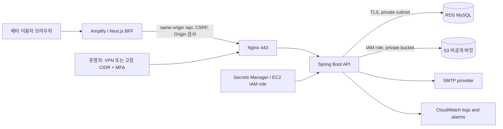

# Herfree 소규모 베타 출시·운영 통제 기준

기준일: 2026-08-03
적용 범위: 현재 웹 서비스의 초대형·소규모 베타 운영

이 문서는 현재 구현된 기능을 기준으로 베타를 배포하고 관리하는 단일 운영 기준이다. 법무법인이 나중에 제공하는 약관·처리방침 문구는 이 문서의 사용자 고지 부분을 교체할 수 있지만, 실제 데이터 흐름과 접근통제를 먼저 바꾸어서는 안 된다. 문구와 실제 동작이 달라지는 변경은 배포 전에 이 문서와 코드를 함께 갱신한다.

## 1. 베타의 범위

베타에서 허용하는 것은 다음뿐이다.

- 익명 커뮤니티와 개인일지의 본인 기능
- 서비스 이용·운영에 관한 비공개 상담문의
- 카카오·구글·네이버 OAuth 로그인
- 별도 동의한 회원의 최소 집계 건강 통계
- 의료기관·전문의 상담을 대체하지 않는 정보 콘텐츠

베타에서 금지하는 것은 다음이다.

- 의료 진단·처방·치료 상담 또는 그에 준하는 개인별 조언
- 치료효과·완치·의료기관 추천을 내세운 광고
- 원문 개인일지·상담 내용을 분석 도구나 외부 업체로 전송
- 개인별 건강상태를 이용한 광고 타기팅
- 결제·유료 광고·제품 큐레이션 공개
- 모바일 앱 출시 전용 기능 추가

약관 문구가 완성되기 전에도 위 범위를 벗어나지 않는 한 코드 구조는 유지할 수 있다. 단, 현재 화면 고지는 실제 동작과 일치해야 한다.

## 2. 전체 구조와 신뢰 경계



핵심 원칙:

1. 브라우저에 API bearer token·DB·S3 자격증명을 노출하지 않는다.
2. 개인일지 메모는 D3 건강정보로 분류하고 AES-GCM field-level encryption과 RDS 저장 암호화를 함께 사용한다.
3. 운영자는 개인일지 원문을 기본 화면에서 보지 않고, 문의 처리·신고 처리에 필요한 최소 범위만 접근한다.
4. 외부에 공개되는 통계는 사용자 수 기준 최소 표본과 소수 셀 억제를 거친 집계값뿐이다.
5. 장애 조사는 원문 대신 `X-Request-ID`, 시각, endpoint, release SHA, 내부 사용자 ID를 사용한다.

## 3. 데이터별 통제 지점

| 데이터 | 등급 | 저장·접근 | 외부 사용 |
| --- | --- | --- | --- |
| 이메일·OAuth provider subject | D1 | DB, 사용자 본인·인증 운영자 최소 조회 | 분석·광고 전송 금지 |
| 게시글·댓글 | D2 | 공개범위·소유자·운영자 권한 검사 | 원문 외부 전송 금지 |
| 개인일지·건강 메모 | D3 | AES-GCM, 소유자 권한, 운영자 기본 비노출 | 원문 사용 금지 |
| 집계 건강 통계 | D3 파생 | 사용자 식별자 제거, 최소 표본·감사 로그 | 승인된 내부 통계만 |
| 비밀번호·JWT·OAuth secret | D4 | 해시·HttpOnly/Secrets Manager | 절대 외부 전송 금지 |

## 4. 개인일지·비식별 통계 파이프라인

개인일지 원문을 그대로 “비식별 데이터”라고 부르지 않는다.

1. 가입 시 건강정보 필수 동의와 통계 활용 선택 동의를 분리한다.
2. 선택 동의가 유효한 회원의 기록에서 필요한 구조화 값만 추출한다.
3. 이메일·닉네임·OAuth ID·정확한 날짜·자유입력 문장·희소 조합을 제거한다.
4. `COUNT(DISTINCT user_id)` 기준으로 서로 다른 사용자 20명 이상, 항목별 5명 이상일 때만 집계값을 반환한다.
5. 소수 셀·희소 지역·희소 날짜·조합 추정 가능성이 있으면 숨긴다.
6. 철회한 회원의 최신 기록은 이후 집계에서 제외한다.
7. 원문과 집계 테이블의 키·권한·보존기간을 분리하고, 집계 조회도 관리자 감사 로그를 남긴다.
8. AI 학습·외부 연구·제3자 제공·광고 타기팅은 현재 베타 범위 밖이다.

## 5. 운영자가 실제로 조작하는 곳

| 운영 목적 | 조작 위치 | 확인할 증거 |
| --- | --- | --- |
| 환경변수·secret | AWS Secrets Manager, EC2 IAM role | secret ARN, 수정자, 교체 시각 |
| 배포 | GitHub Actions `release-backend.yml` | commit SHA, image digest, workflow run |
| 프론트 환경 | Amplify 환경변수 | `API_REWRITE_TARGET`, OAuth redirect origin |
| API 접근 | `ADMIN_ACCESS_ALLOWED_CIDRS`, VPN/MFA | 허용 CIDR, 관리자 계정별 감사 로그 |
| DB 보호 | RDS private subnet, TLS CA, KMS, PITR | 보안그룹·TLS·백업 설정 캡처 |
| 파일 보호 | S3 public access block, IAM prefix 정책 | bucket policy, IAM policy, 업로드·삭제 테스트 |
| 장애 대응 | CloudWatch alarm, SSM, rollback script | alarm 상태, request ID, rollback 결과 |
| 보존·삭제 | retention 환경변수와 cleanup job | 실행 로그, 파기 대상·시각 |
| 개인정보 요청 | 운영 문의·회원 탈퇴·삭제 절차 | 요청 ID, 처리자, 처리 결과 |

운영 서버에 SSH로 코드를 고치거나 수동 SQL로 개인정보를 수정하지 않는다. 모든 변경은 PR → CI → staging → 같은 digest 승격 순서를 따른다.

## 6. 베타 배포 승인 게이트

### 자동 게이트

저장소 루트에서 실행한다.

```powershell
powershell.exe -NoProfile -ExecutionPolicy Bypass -File .\scripts\service-harness.ps1 `
  -RunLocalSmoke -RequireAdminSmoke -RequireDockerIntegration `
  -ReportPath artifacts/service-harness/beta.md
```

다음이 모두 PASS여야 한다.

- 백엔드 전체 테스트·컴파일
- 프론트 lint·unit·production build
- secret scan·민감 로그 scan
- MySQL Flyway 적용과 Hibernate `ddl-auto=validate`
- 일반 계정의 타인 개인일지·문의 접근 차단
- 관리자 집계 응답에 이메일·원문·사용자 ID가 없음
- `/api/health`, BFF 세션·CSRF·Origin 경계
- npm·컨테이너 취약점 게이트

### 외부 환경 게이트

실제 staging에서 운영자가 확인해야 한다.

- HTTPS 도메인, OAuth 3종 callback, SMTP reset 메일
- private RDS와 CA 검증 TLS
- S3 업로드·조회·삭제·10MB 초과 거부
- 관리자 MFA 또는 VPN/CIDR 접근 게이트
- RDS snapshot/PITR와 격리 복원 drill
- CloudWatch 5xx·health·RDS·디스크·로그 알람
- 비회원·일반 계정·관리자 세 계정의 권한 흐름
- 탈퇴·삭제·동의 철회 후 원문·집계·로그 처리

외부 게이트는 로컬 테스트 PASS로 대체하지 않는다.

## 7. 배포 순서

1. 변경 파일과 Flyway migration을 검토한다.
2. `service-harness.ps1`를 실행하고 리포트를 보존한다.
3. `verify-deploy-readiness.ps1`로 Git tree, workflow, Docker, GitHub/AWS 인증을 확인한다.
4. `main`과 frontend `develop`의 프론트 tree 일치를 확인한다.
5. GitHub Actions에서 `target=staging`을 실행한다.
6. staging 브라우저·OAuth·mutation QA를 완료한다.
7. `staging-passed-<40자리 SHA>`가 생성된 것을 확인한다.
8. production 직전 RDS pre-deploy snapshot ID와 rollback digest를 기록한다.
9. 같은 staging-tested digest로 production을 승인 배포한다.
10. 5분 smoke와 30분 모니터링을 수행한다.

## 8. 즉시 중단·rollback 조건

- 타인의 개인일지·문의·비공개 이미지가 한 건이라도 노출됨
- 로그·분석 이벤트에 건강 메모, 이메일, 토큰, reset URL이 기록됨
- DB migration 실패, 데이터 손실, 복원 불확실
- API health 실패 또는 5xx 급증
- S3 public access 또는 IAM 권한 변경 발견
- 관리자 계정 탈취·MFA 우회 의심
- OAuth·SMTP·삭제·동의철회 흐름이 실제 정책과 다르게 동작함

이 경우 신규 배포를 멈추고 계정·키·접근을 차단한 뒤, `infra/scripts/rollback-release.sh` 또는 검증된 복원 절차를 사용한다. DB migration은 이미지 rollback만으로 되돌리지 않는다.

## 9. 일상 관리 주기

- 매일: health, 5xx, 인증 실패, 문의·신고 대기열, 관리자 감사 실패
- 매주: 관리자 권한, IAM 변경, 백업 성공, Dependabot·CodeQL·Trivy
- 매월: 로그 원문 표본 검사, 만료 데이터 파기, RDS 복원 drill, 비용·저장공간
- 분기: DAST, 통계 재식별 검토, 사고 tabletop, 운영자 권한 재승인

## 10. 현재 상태의 해석

코드·로컬 하네스·Docker MySQL·BFF·관리자 개인정보 경계는 자동 검증할 수 있다. 그러나 AWS 계정, 도메인, OAuth 실제 callback, SMTP, private RDS, 백업 복원은 외부 증거가 있어야 `PASS`가 된다. 이 문서는 그 증거를 어디서 만들고 누가 확인하는지 고정하는 기준이며, 테스트 리포트만으로 외부 환경 완료를 주장하지 않는다.
