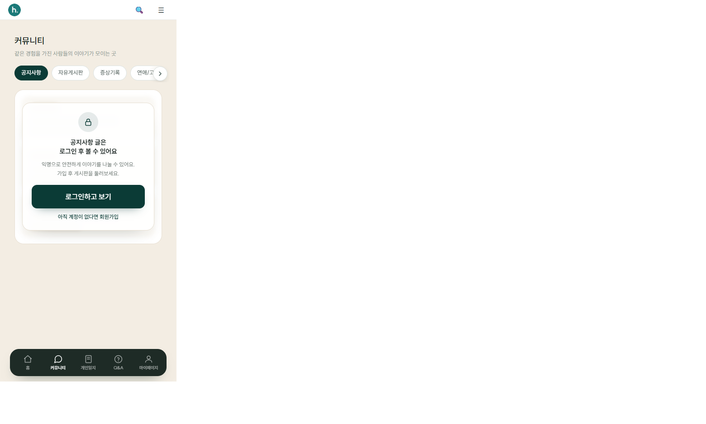
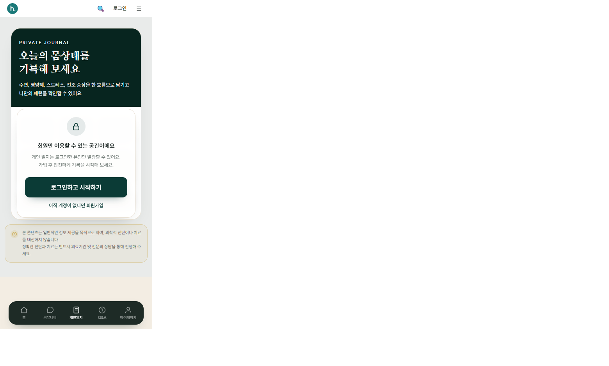
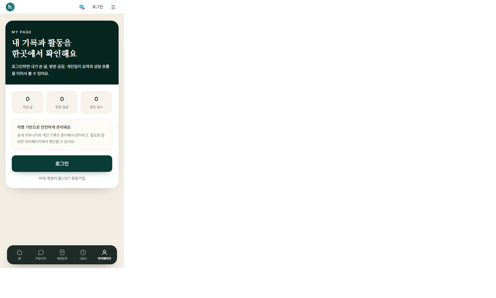
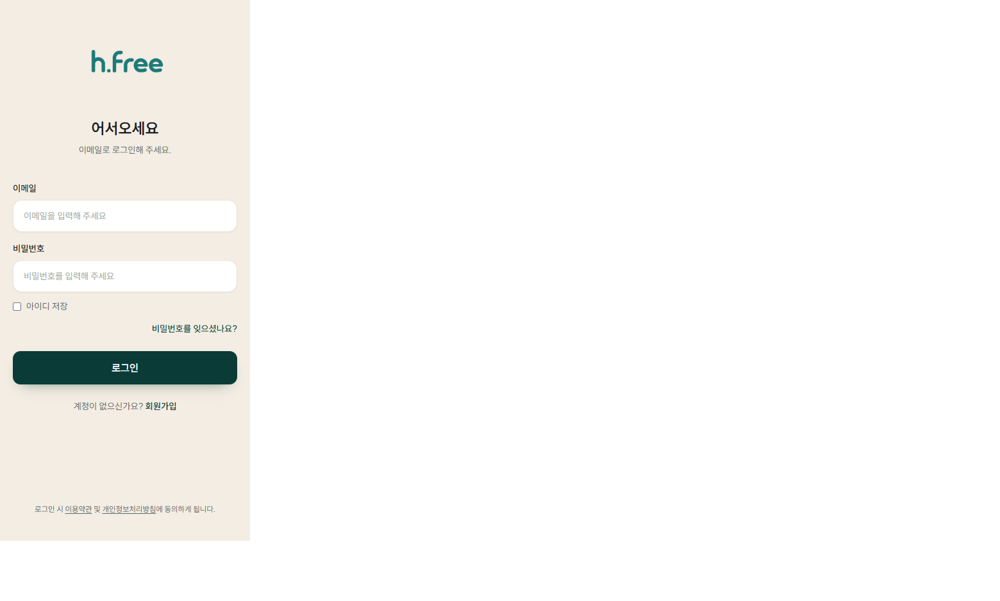
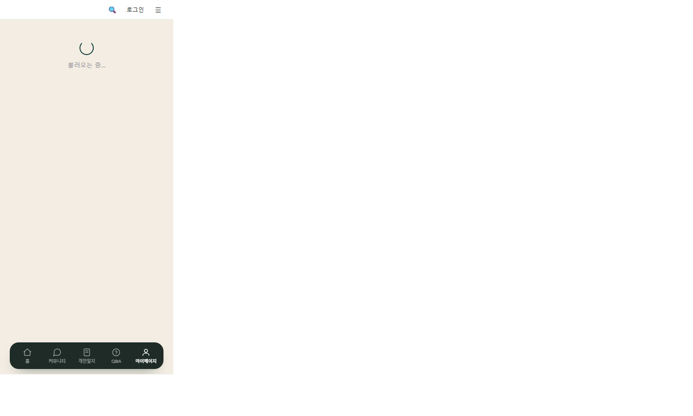
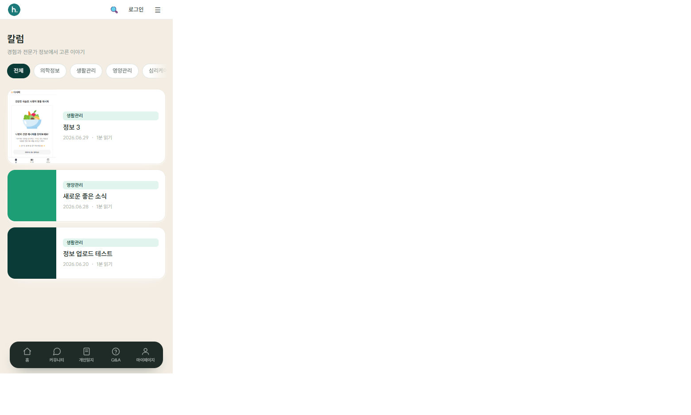

# Herfree — 포트폴리오 요약 (취업용)

> 헤르페스·감염 불안 사용자를 위한 **익명 건강 커뮤니티 + 비공개 증상 일지** 웹 서비스  
> 풀스택 개인 프로젝트 · 1차 MVP 기준 실서비스 가능 수준까지 구현

---

## 한 줄 소개

**익명 커뮤니티**, **본인만 보는 개인 일지**, **운영자 큐레이션(칼럼·영상)** 을 한 앱에서 역할 분리해 설계·구현한 헬스케어 커뮤니티 플랫폼입니다.

---

## 담당·구현 포인트

| 영역 | 내용 |
|------|------|
| **프론트** | Next.js App Router, 모바일 퍼스트 UI, 게스트/회원 분기, 하단 탭 네비게이션 |
| **백엔드** | Spring Boot 3.3 REST API, JWT 인증, 도메인별 계층 분리 |
| **UX** | 비로그인 시 탭·구조는 보이고 **콘텐츠만 잠금** (커뮤니티·일지·마이페이지) |
| **운영** | 관리자 CMS(공지·칼럼·영상), 신고·숨김 처리, Flyway 마이그레이션 |
| **인프라** | MySQL 8, S3 이미지 프록시 업로드, 로컬/ngrok 모바일 데모 |

---

## 기술 스택

- **Frontend:** Next.js 14, TypeScript, Tailwind CSS, custom hooks
- **Backend:** Java 17, Spring Boot 3.3, Spring Security, JPA, Flyway
- **DB:** MySQL 8
- **Auth:** JWT (Stateless)
- **Storage:** AWS S3 (게시글 이미지, API 경유 업로드)

---

## 화면 캡처 (모바일 뷰)

### 1. 비회원 홈 — 랜딩 + 퀵액세스 + 하단 탭



- 비로그인 랜딩, 회원 전용 영역 안내, DAY 1 온보딩 카드
- **홈 · 커뮤니티 · 개인일지 · Q&A · 마이페이지** 하단 네비게이션

---

### 2. 커뮤니티 (비회원) — 탭은 보이고 글만 잠금


- 게시판 탭(공지·자유·증상기록 등) 탐색 가능
- 글 목록은 로그인 유도 패널로 가림 (API 호출 없음)

---

### 3. 개인 일지 (비회원) — 프라이빗 잠금



- 일지는 본인만 열람 가능하다는 메시지 + 로그인/가입 CTA

---

### 4. 마이페이지 (비회원)



- 활동 요약 프리뷰(0건) + 로그인 유도

---

### 5. 로그인



- 브랜드 워드마크, 이메일 로그인 폼

---

### 6. Q&A (FAQ)



- 아코디언 FAQ, 서비스·일지·상담 정책 안내

---

### 7. 칼럼 (운영자 큐레이션)



- 카테고리 필터, 운영자 등록 정보글 목록

---

## 데모 접속

### 로컬

| | URL |
|---|-----|
| 웹 | http://localhost:3000 |
| API | http://localhost:8080 |

> 포트 3000이 이미 사용 중이면 **이전 Next.js 프로세스가 남아 있는 것**입니다.  
> `netstat -ano | findstr ":3000 "` 로 PID 확인 후 종료하고 다시 `npm run dev` 하세요.

### ngrok (모바일·외부 공유)

**현재 이 PC에서는 ngrok 터널이 실행 중이지 않습니다.**  
아래 순서로 켜면 주소가 나옵니다.

```powershell
# 1) MySQL + 백엔드 + 프론트 실행 (각각 별도 터미널)
cd C:\dev\herfree-platform
docker compose -f docker-compose.local.yml up -d

cd C:\dev\herfree-platform\backend
.\gradlew bootRun

cd C:\dev\herfree-platform\frontend
npm run dev

# 2) ngrok (프론트 포트 — 보통 3000)
ngrok http 3000
```

또는 준비 상태 확인 후 안내:

```powershell
cd C:\dev\herfree-platform
.\scripts\ngrok-demo.ps1
```

터미널에 표시되는 주소 예시:

```
Forwarding   https://xxxx-xxxx.ngrok-free.dev -> http://localhost:3000
```

**이 `https://....ngrok-free.dev` 주소를 폰·면접관에게 공유**하면 됩니다.  
백엔드는 따로 열 필요 없습니다 (Next.js `/api` 프록시가 Spring으로 연결).

---

## 테스트 계정 (로컬)

| | |
|---|---|
| 관리자 이메일 | `admin@herfree.local` |
| 비밀번호 | `HerfreeAdmin01` |

---

## 저장소·문서

- 상세 README: [../README.md](../README.md)
- API 명세: [api-spec.md](./api-spec.md)
- 요구사항: [requirements.md](./requirements.md)

---

## 이력서용 한 줄 (복사용)

> **Herfree** — Spring Boot + Next.js 기반 익명 건강 커뮤니티. JWT 인증, 게시판·댓글·신고, 비공개 증상 일지, 운영자 CMS(칼럼·영상), 게스트 UX(탭 노출·콘텐츠 잠금), 모바일 하단 네비게이션까지 1차 MVP 구현.
