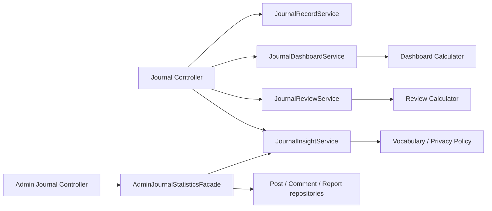

# Herfree 책임 기반 리팩터링 사례

## 문제와 제약

Herfree는 익명 커뮤니티와 비공개 증상 일지를 함께 제공한다. 일지는 건강정보이므로 단순히 파일을 작게 만드는 것보다 다음 계약을 안정적으로 보존하는 것이 우선이었다.

- 본인 이외의 기록 조회·삭제는 존재 여부를 드러내지 않는 `404`여야 한다.
- `recordDate`는 KST 기준 `LocalDate`이고 기존 JSON은 `YYYY-MM-DD`를 유지해야 한다.
- 공개 통계에는 최신 건강정보 통계 동의가 있는 회원의 구조화된 값만 사용하며, 서로 다른 사용자 20명·항목 5명 미만은 공개하지 않는다.
- 공개·관리자 통계에는 원문 메모, userId, 이메일을 포함하지 않는다.
- 구조 리팩터는 REST URL, DTO, DB 스키마, 기존 기록을 바꾸지 않는다.

## 진단

기존 `JournalService`에는 기록 CRUD, 개인 대시보드, 30일 리뷰, 공개 인사이트, 관리자 통계가 함께 있었다. 이 상태에서는 대시보드 계산을 바꿀 때 공개 통계와 운영 지표까지 함께 검토해야 했고, `Post`·`Comment`·`Report` Repository 의존성이 개인 일지 기능에도 전파됐다.

프론트도 큰 페이지에 API mutation, 권한 판단, 확인 모달, 렌더링이 함께 있어 관리자 기능을 추가할 때 사용자의 권한 흐름을 실수할 위험이 있었다.

## 선택한 설계

- `JournalRecordService`는 기록 CRUD와 소유자 검증만 담당한다.
- `JournalDashboardService`와 `JournalReviewService`는 조회·조립을, 순수 Calculator는 상태·기간·정렬 계산을 맡는다. 현재 날짜는 입력값으로 받아 테스트가 시간에 의존하지 않는다.
- `JournalInsightService`는 동의·최소 표본·비식별 규칙을 한 위치에서 적용한다.
- `AdminJournalStatisticsFacade`만 운영 화면에 필요한 교차 도메인 수치를 조합한다. 이것이 Repository 공유를 허용하는 유일한 예외다.
- 프론트의 page는 route 조립만 맡기고, feature container/hook이 API·mutation·confirm 상태를 소유한다. `useAsyncMutation`은 중복 실행 방지와 pending/error까지만 공통화한다.

## 의도적으로 하지 않은 것

- `BaseCrudService`, `useCrud()`, 범용 CRUD Form을 도입하지 않았다. 일지·신고·회원 제재는 성공과 실패의 의미, 권한, 후속 동작이 다르다.
- 미래의 Health Card·Medication을 이유로 `RecordService<T>`를 만들지 않았다. 두 번째 기록 기능이 생긴 뒤 날짜·소유자·동의·집계 규칙의 실제 공통성이 확인될 때만 공통 정책을 추출한다.
- 기존 건강 기록의 미등록 값을 자동 변환하거나 삭제하지 않는다. 새 입력 검증은 데이터 현황과 클라이언트 배포를 확인한 뒤 단계적으로 강화하며, 미등록 값은 공개 통계에서 제외한다.

## 검증 전략

1. 기존 REST 응답, 권한, 동의, 날짜 규칙을 characterization test로 먼저 고정한다.
2. Calculator/Policy는 단위 테스트로 경계값을 검증한다.
3. Service/facade는 Mockito 테스트로 의존성·조합을 검증하고, MVC/Security 테스트로 endpoint 계약을 확인한다.
4. 프론트는 Vitest + React Testing Library로 policy, hook, 표시 컴포넌트를 검증하고, Playwright는 로그인·비공개 게시판·일지 저장·관리자 moderation 여정을 확인한다.
5. 기능 오류는 구조 분리와 섞지 않는다. 단, 동의·권한·노출·데이터 유실은 P0으로 별도 긴급 수정한다.

## 면접에서 설명할 핵심

> “SOLID를 적용하기 위해 클래스를 늘린 것이 아니라, 건강 기록의 변경·검토·보안 책임이 서로 다르다는 점에서 출발했습니다. 개인 기능은 다른 도메인의 운영 데이터에 의존하지 않게 하고, 필요한 운영 조합만 facade에 격리했습니다. 또한 미래 기능을 가정한 범용 추상화 대신 실제 중복이 확인될 때만 공통화해, 확장성보다 현재의 이해 가능성과 안전한 변경을 우선했습니다.”

성공 기준은 줄 수 감소가 아니라, 공개 통계·관리자 통계·새 기록 화면을 추가할 때 기록 CRUD와 개인정보 규칙을 다시 수정하지 않아도 되는지로 판단한다.
